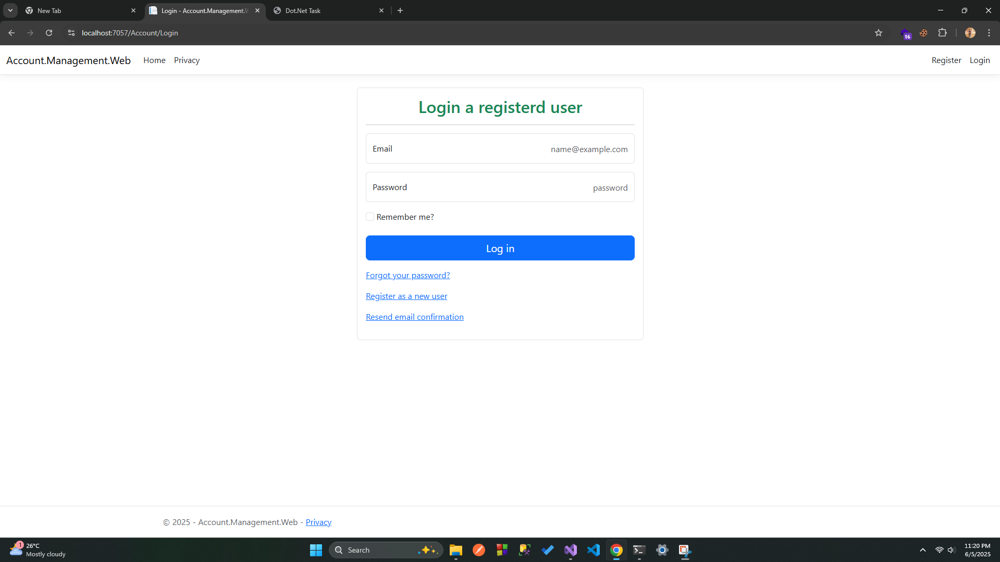

# Mini-Account-Management-System

## Project Setup Guideline

1. **Clone the Repository**  
   `https://github.com/habibor-rahaman1010/Mini-Account-Management-System/tree/main`

2. **Create a Database in SQL Server Management Studio (SSMS)**  
   - Open SSMS.  
   - Create a new database and name it **AccountManagement** .

3. **Execute the Database Script**  
   - Open the file **/SqlScripts/DatabaseSetup.sql**.  
   - Copy its entire SQL content.  
   - In SSMS, select the **AccountManagement** database, paste the script into a new query window, and **Execute**.

4. **Run the EF-Core Migration for ASP.NET Identity**  
   - In Visual Studio’s **Package Manager Console** (or any terminal), run:  
   
     "dotnet ef database update -c "ApplicationDbContext" -p "Account.Management.Web""
   
   - This command adds the seven built-in ASP.NET Identity tables to the same database.

That’s it—run the project and navigate using the navigation bar on the first page.

---

### Roles

| Role | Username | Password | Can Access |
|------|----------|----------|------------|
| **Admin** | `user.admin@gmail.com` | `admin123` | **AddUser**, **AddRole**, **AssignAccess**, **AssignUserRole** |
| **Accountant** | `user.accountant@gmail.com` | `accountant123` | **ChartOfAccounts**, **VoucherList** |
| **Viewer** | Any self-registered user | *(chosen at signup)* | VoucherList |

Newly registered users are automatically placed in the **Viewer** role.

### 1. Registration Page  

### 2. Validation Registration Page  

### 3. Login Page  

### 4. Validation Login Page  

### 5. After Login Home page  

### 6. Dashboard Page  

### 7. Users List  

### 8. user Edit  

### 9. User Delete  

### 10. Role Create Page  

### 11. Role List  

### 12. Edit Role  

### 13. Change User Role 

### 14. Create Chart Of Account  

### 15. Chart Of Account  

### 16. Update Chart Of Account  

### 17. Voucher Type List

### 18. Create Voucher Type  

### 19. Create Voucher Type  

### 20. Create Voucher Type  

### 21. Create Voucher Type  

### 22. Create Voucher Type  

### 23. Create Voucher Type  

### 24. Create Voucher Type  

